### 概述

ELK Stack自首次推出以来，其各种组件的下载量已达数百万，是世界上最受欢迎的日志管理平台。本文将通过对ELK Stack的起源、组成、架构和实际部署来对其进行学习和理解。

### 什么是ELK Stack？

首先是名称，与ELK Stack相关的还有两个：一个是Elastic Stack；另一个是更简单的ELK。根据官网的解释：ELK Stack指的就是 Elastic Stack。ELK则是我们对ELK Stack的简称。所以，这三者本质就是一个东西。

其次，那ELK 到底是什么呢？“ELK”是三个开源项目的首字母缩写，这三个项目分别是：Elasticsearch、Logstash 和 Kibana。Elasticsearch 是一个搜索和分析引擎。Logstash 是服务器端数据处理管道，能够同时从多个来源采集数据，转换数据，然后将数据发送到诸如 Elasticsearch 等“存储库”中。Kibana 则可以让用户在 Elasticsearch 中使用图形和图表对数据进行可视化。Elastic Stack 则是 ELK Stack 的更新换代产品。


### ELK起源

据ELK官方称，一切都起源于 Elasticsearch。Elasticsearch是一个开源的分布式搜索引擎，基于 JSON 开发而来，具有 RESTful 风格。它使用简单，可缩放规模，十分灵活，因此受到用户的热烈好评。Elasticsearch 的核心是搜索引擎，所以用户开始将其用于日志系统，并希望能够轻松地对日志进行采集和可视化。所以，他们引入了采集工具Logstash 和可视化工具 Kibana，组成了日志系统ELK。2015 年，他们又向 ELK Stack 中加入了一系列轻量型的单一功能数据采集器，并把它们叫做 Beats。

**注**：参考链接 [ELK Stack](https://www.elastic.co/cn/what-is/elk-stack)

### ELK架构

对于小型开发环境，经典架构如下所示：


#### Beats

Beats是一组开源的轻量级日志采集工具，用Go语言编写，效率高，占用资源少且彼此之间相互独立，没有依赖关系。

不同beat采集不同数据。Filebeat采集日志文件、Packetbeat采集网络数据、Metricbeat采集系统和服务指标、Winlogbeat采集Windows事件日志，等等。

#### Logstash 

Logstash 最初是一个开源工具，ELK中的 “L” 指的就是Logstash 。主要负责收集和处理多来源的日志数据，然后将数据输出到指定目的地进行存储。Logstash 有超过 200 个不同的插件，可用于收集、丰富和转换各种不同的数据类型。

#### Beats 和 Logstash 的演变

在最初的架构中，是没有 Beats 的，只有 ELK 。日志采集处理功能全部由 Logstash 完成。但是 Logstash 一直存在一个突出的问题，那就是性能。Logstash 是用 Ruby 实现的，需要运行在 JVM 上，在采集多源日志和需要日志过滤处理时，会非常消耗内存。于是在 2015 年，ELK中加入了使用Go开发的轻量级的采集工具Beats，不同的Beats 安装在不同的场景中用于采集日志或指标。

只用 Beats 就够了，为什么还要用 Logstash ？

1. 以 Filebeat 举例，Filebeat 和 Logstash 都可以将每一行日志转化为JSON格式，但是大多数情况下 Filebeat 无法使用过滤器将日志转化为易于分析的结构化日志，而 Logstash 可以做到；
2. Logstash 在整个架构中充当聚合器。将数据从不同的数据源读出，然后输出到 Elasticsearch。
3. Beat 数量较多时（例如 Kubernetes 集群中的日志收集系统），直接向 Elasticsearch 发送数据会产生太多的并发索引，这可能会导致队列容量过大、响应时间过长或超时。因此，通常在 Beat 实例和 Elasticsearch 之间添加 Logstash 用来控制索引。

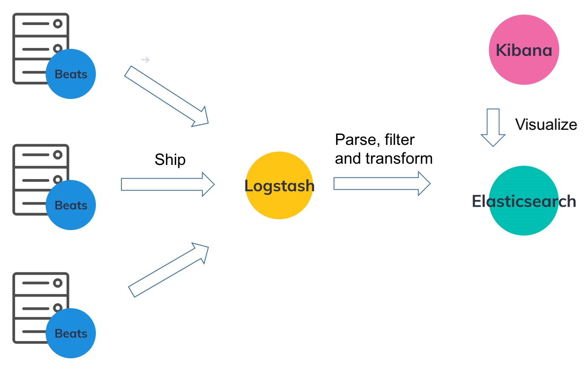

#### Elasticsearch

Elasticsearch 主要用于搜索和分析日志，是当今[最流行的数据库系统](https://db-engines.com/en/blog_post/70)之一。Elasticsearch 最初于 2010 年发布，是一个基于 Apache Lucene 的现代搜索和分析引擎。Elasticsearch 完全开源并使用 Java 构建，被归类为 NoSQL 数据库，以非结构化方式存储数据。Elasticsearch 是一个功能丰富且复杂的系统，在此不做详细的说明，有兴趣了解更多的可以查看此链接 [Elasticsearch](https://www.elastic.co/guide/en/elasticsearch/reference/current/index.html) 

#### Kibana

Kibana 是一个完全开源的、用户界面基于浏览器可视化工具。可以对 Elasticsearch 索引中的数据进行搜索、分析和可视化（Kibana 不能与其他数据库结合使用）。Kibana 具有丰富的图形和可视化功能。有兴趣了解更多的可以查看此链接 [Kibana](https://www.elastic.co/guide/en/kibana/current/index.html) 


对于更大规模的系统，高峰值期间仍然可能由于 Logstash 处理日志性能不够而出现日志拥塞或日志丢失的情况出现，常见的处理方式是在在 Beats 和 Logstash 之间建立一个缓冲消息队列，架构如下：

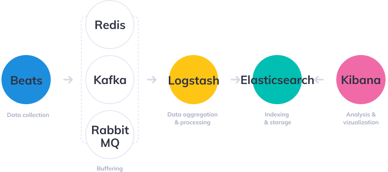

接下来会以此架构为基础进行实际部署，深入学习和理解 ELK 。


### 部署

#### 前提条件

- Kubernetes 1.19+
- Helm 3.2.0+ 

**注**：Helm安装参考 [helm install](https://helm.sh/zh/docs/intro/install/) 

#### 系统架构

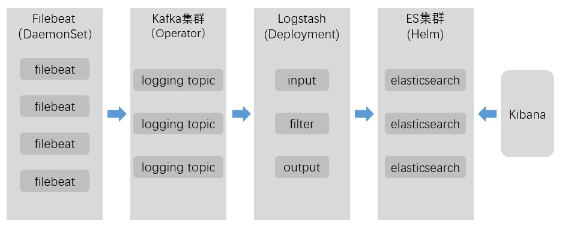

#### 部署Kafka

Kafka部署使用Strimzi Kafka，官网为 https://strimzi.io/ 。

查看Strimzi版本和对应的kafka版本，对应关系如下，参考 [Strimzi](https://strimzi.io/downloads/) 。

| Operators                                                    | Strimzi Kafka Bridge                                         | Strimzi OAuth                                                | Kafka versions                    | Kubernetes versions |
| ------------------------------------------------------------ | ------------------------------------------------------------ | ------------------------------------------------------------ | --------------------------------- | ------------------- |
| [0.27.1](https://github.com/strimzi/strimzi-kafka-operator/releases/tag/0.27.1) | [0.21.3](https://github.com/strimzi/strimzi-kafka-bridge/releases/tag/0.21.3) | [0.9.0](https://github.com/strimzi/strimzi-kafka-oauth/releases/tag/0.9.0) | 2.8.0, 2.8.1, 3.0.0               | 1.16+               |
| [0.27.0](https://github.com/strimzi/strimzi-kafka-operator/releases/tag/0.27.0) | [0.21.2](https://github.com/strimzi/strimzi-kafka-bridge/releases/tag/0.21.2) | [0.9.0](https://github.com/strimzi/strimzi-kafka-oauth/releases/tag/0.9.0) | 2.8.0, 2.8.1, 3.0.0               | 1.16+               |
| [0.26.1](https://github.com/strimzi/strimzi-kafka-operator/releases/tag/0.26.1) | [0.21.0](https://github.com/strimzi/strimzi-kafka-bridge/releases/tag/0.21.0) | [0.9.0](https://github.com/strimzi/strimzi-kafka-oauth/releases/tag/0.9.0) | 2.8.0, 2.8.1, 3.0.0               | 1.16+               |
| [0.26.0](https://github.com/strimzi/strimzi-kafka-operator/releases/tag/0.26.0) | [0.20.3](https://github.com/strimzi/strimzi-kafka-bridge/releases/tag/0.20.3) | [0.9.0](https://github.com/strimzi/strimzi-kafka-oauth/releases/tag/0.9.0) | 2.8.0, 2.8.1, 3.0.0               | 1.16+               |
| [0.25.0](https://github.com/strimzi/strimzi-kafka-operator/releases/tag/0.25.0) | [0.20.2](https://github.com/strimzi/strimzi-kafka-bridge/releases/tag/0.20.2) | [0.8.1](https://github.com/strimzi/strimzi-kafka-oauth/releases/tag/0.8.1) | 2.7.0, 2.7.1, 2.8.0               | 1.16+               |
| [0.24.0](https://github.com/strimzi/strimzi-kafka-operator/releases/tag/0.24.0) | [0.20.1](https://github.com/strimzi/strimzi-kafka-bridge/releases/tag/0.20.1) | [0.8.1](https://github.com/strimzi/strimzi-kafka-oauth/releases/tag/0.8.1) | 2.7.0, 2.7.1, 2.8.0               | 1.16+               |
| [0.23.0](https://github.com/strimzi/strimzi-kafka-operator/releases/tag/0.23.0) | [0.19.0](https://github.com/strimzi/strimzi-kafka-bridge/releases/tag/0.19.0) | [0.7.2](https://github.com/strimzi/strimzi-kafka-oauth/releases/tag/0.7.2) | 2.6.0, 2.6.1, 2.6.2, 2.7.0, 2.8.0 | 1.16+               |
| [0.22.1](https://github.com/strimzi/strimzi-kafka-operator/releases/tag/0.22.1) | [0.19.0](https://github.com/strimzi/strimzi-kafka-bridge/releases/tag/0.19.0) | [0.7.1](https://github.com/strimzi/strimzi-kafka-oauth/releases/tag/0.7.1) | 2.5.0, 2.5.1, 2.6.0, 2.6.1, 2.7.0 | 1.16+               |
| [0.22.0](https://github.com/strimzi/strimzi-kafka-operator/releases/tag/0.22.0) | [0.19.0](https://github.com/strimzi/strimzi-kafka-bridge/releases/tag/0.19.0) | [0.7.1](https://github.com/strimzi/strimzi-kafka-oauth/releases/tag/0.7.1) | 2.5.0, 2.5.1, 2.6.0, 2.6.1, 2.7.0 | 1.16+               |
| [0.21.1](https://github.com/strimzi/strimzi-kafka-operator/releases/tag/0.21.1) | [0.19.0](https://github.com/strimzi/strimzi-kafka-bridge/releases/tag/0.19.0) | [0.6.1](https://github.com/strimzi/strimzi-kafka-oauth/releases/tag/0.6.1) | 2.5.0, 2.5.1, 2.6.0, 2.7.0        | 1.16+               |
| [0.21.0](https://github.com/strimzi/strimzi-kafka-operator/releases/tag/0.21.0) | [0.19.0](https://github.com/strimzi/strimzi-kafka-bridge/releases/tag/0.19.0) | [0.6.1](https://github.com/strimzi/strimzi-kafka-oauth/releases/tag/0.6.1) | 2.5.0, 2.5.1, 2.6.0, 2.7.0        | 1.16+               |
| [0.20.1](https://github.com/strimzi/strimzi-kafka-operator/releases/tag/0.20.1) | [0.19.0](https://github.com/strimzi/strimzi-kafka-bridge/releases/tag/0.19.0) | [0.6.1](https://github.com/strimzi/strimzi-kafka-oauth/releases/tag/0.6.1) | 2.5.0, 2.5.1, 2.6.0               | 1.11+               |
| [0.20.0](https://github.com/strimzi/strimzi-kafka-operator/releases/tag/0.20.0) | [0.19.0](https://github.com/strimzi/strimzi-kafka-bridge/releases/tag/0.19.0) | [0.6.1](https://github.com/strimzi/strimzi-kafka-oauth/releases/tag/0.6.1) | 2.5.0, 2.5.1, 2.6.0               | 1.11+               |

选择版本0.23.0，下载解压并进入目录。

```bash
$ wget -c https://github.com/strimzi/strimzi-kafka-operator/releases/download/0.23.0/strimzi-0.23.0.tar.gz
$ tar -zxvf strimzi-0.23.0.tar.gz
$ cd strimzi-0.23.0/
```

安装到kafka-cluster-operator的namespace中，修改yaml文件中的命名空间，namespace可自由选择。

```bash
$ sed -i 's/namespace: .*/namespace: kafka-cluster-operator/' install/cluster-operator/*RoleBinding*.yaml
```

编辑install/cluster-operator/060-Deployment-strimzi-cluster-operator.yaml文件以将`STRIMZI_NAMESPACE`环境变量的值设置为`*`,修改后文件如下：

```yaml
apiVersion: apps/v1
kind: Deployment
spec:
  ...
  template:
    spec:
      ...
      serviceAccountName: strimzi-cluster-operator
      containers:
      - name: strimzi-cluster-operator
        image: quay.io/strimzi/operator:0.23.0
        imagePullPolicy: IfNotPresent
        env:
        #修改下面 STRIMZI_NAMESPACE 的值为 *
        - name: STRIMZI_NAMESPACE
          value: "*"
        - name: STRIMZI_FULL_RECONCILIATION_INTERVAL_MS
          value: "120000"
        ...
```

创建 `ClusterRoleBindings` 将所有命名空间的集群范围访问权限授予 Cluster Operator。

```bash
$ kubectl create clusterrolebinding strimzi-cluster-operator-namespaced --clusterrole=strimzi-cluster-operator-namespaced --serviceaccount kafka-cluster-operator:strimzi-cluster-operator
$ kubectl create clusterrolebinding strimzi-cluster-operator-entity-operator-delegation --clusterrole=strimzi-entity-operator --serviceaccount kafka-cluster-operator:strimzi-cluster-operator
$ kubectl create clusterrolebinding strimzi-cluster-operator-topic-operator-delegation --clusterrole=strimzi-topic-operator --serviceaccount kafka-cluster-operator:strimzi-cluster-operator
```

将 Cluster Operator 部署到 Kubernetes 集群。

```bash
$ kubectl create ns kafka-cluster-operator
$ kubectl create -f install/cluster-operator -n kafka-cluster-operator
```

验证 Cluster Operator 是否已成功部署：

```bash
$ kubectl get deployments -n kafka-cluster-operator
NAME                       READY   UP-TO-DATE   AVAILABLE   AGE
strimzi-cluster-operator   1/1     1            1           2m58s
```

Strimzi 提供了用于部署Kafka的示例 YAML 文件，在 examples/kafka/ 目录下：

- kafka-persistent.yaml：部署具有三个 ZooKeeper 和三个 Kafka 节点的持久集群。

- kafka-jbod.yaml：部署具有三个 ZooKeeper 和三个 Kafka 节点（每个使用多个持久卷）的持久集群。

- kafka-persistent-single.yaml：部署具有单个 ZooKeeper 节点和单个 Kafka 节点的持久集群。

- kafka-ephemeral.yaml：部署具有三个 ZooKeeper 和三个 Kafka 节点的临时集群。

- kafka-ephemeral-single.yaml：部署一个具有三个 ZooKeeper 节点和一个 Kafka 节点的临时集群。

部署临时集群到 logging namespace 下：

```bash
$ kubectl create ns logging
$ kubectl apply -f examples/kafka/kafka-ephemeral.yaml -n logging
```

等待一段时间，验证是否部署完成：

```bash
$ kubectl get all -n logging
NAME                                              READY   STATUS    RESTARTS   AGE
pod/my-cluster-entity-operator-6d48588c9f-ddp9q   3/3     Running   0          70s
pod/my-cluster-kafka-0                            1/1     Running   0          97s
pod/my-cluster-kafka-1                            1/1     Running   0          97s
pod/my-cluster-kafka-2                            1/1     Running   0          97s
pod/my-cluster-zookeeper-0                        1/1     Running   0          2m51s
pod/my-cluster-zookeeper-1                        1/1     Running   1          2m51s
pod/my-cluster-zookeeper-2                        1/1     Running   0          2m51s

NAME                                  TYPE        CLUSTER-IP     EXTERNAL-IP   PORT(S)                               AGE
service/my-cluster-kafka-bootstrap    ClusterIP   10.110.14.37   <none>        9091/TCP,9092/TCP,9093/TCP            98s
service/my-cluster-kafka-brokers      ClusterIP   None           <none>        9090/TCP,9091/TCP,9092/TCP,9093/TCP   98s
service/my-cluster-zookeeper-client   ClusterIP   10.108.148.7   <none>        2181/TCP                              2m52s
service/my-cluster-zookeeper-nodes    ClusterIP   None           <none>        2181/TCP,2888/TCP,3888/TCP            2m52s


NAME                                         READY   UP-TO-DATE   AVAILABLE   AGE
deployment.apps/my-cluster-entity-operator   1/1     1            1           70s

NAME                                                    DESIRED   CURRENT   READY   AGE
replicaset.apps/my-cluster-entity-operator-6d48588c9f   1         1         1       70s

NAME                                    READY   AGE
statefulset.apps/my-cluster-kafka       3/3     97s
statefulset.apps/my-cluster-zookeeper   3/3     2m51s
```

已经全部完成，如要部署持久集群，则：

```bash
$ kubectl create ns logging
$ kubectl apply -f examples/kafka/kafka-persistent.yaml -n logging
```

**注**：部署过程参考链接 [Deploying Kafka](https://strimzi.io/docs/operators/0.23.0/deploying.html#deploying-cluster-operator-to-watch-whole-cluster-str) 

#### 部署Elasticsearch和Kibana

部署 Elasticsearch 和 Kibana 到 logging namespace 下：

```bash
$ helm repo add bitnami https://charts.bitnami.com/bitnami
$ helm install es bitnami/elasticsearch -n logging \
  --set global.kibanaEnabled=true \
  --create-namespace \
  --set master.heapSize=512m \
  --set coordinating.heapSizee=512m \
  --render-subchart-notes
```

验证是否部署完成，状态为 deployed：

```bash
$ helm list -n logging
NAME    	NAMESPACE	REVISION	UPDATED                                	STATUS  	CHART               	APP VERSION
es      	logging  	1       	2022-02-15 09:02:26.694803054 +0000 UTC	deployed	elasticsearch-17.5.5	7.16.2
```

如果 kibana 需要外部浏览器访问，则需要修改 es-kibana Service type 为 NodePort：

```bash
$ kubectl edit svc es-kibana -n logging
```

修改完成后如下：

```yaml
# Please edit the object below. Lines beginning with a '#' will be ignored,
# and an empty file will abort the edit. If an error occurs while saving this file will be
# reopened with the relevant failures.
#
apiVersion: v1
kind: Service
metadata:
  annotations:
    meta.helm.sh/release-name: es
    meta.helm.sh/release-namespace: logging
  creationTimestamp: "2022-02-15T09:02:27Z"
  labels:
    app.kubernetes.io/instance: es
    app.kubernetes.io/managed-by: Helm
    app.kubernetes.io/name: kibana
    helm.sh/chart: kibana-9.1.6
  name: es-kibana
  namespace: logging
  resourceVersion: "120118709"
  uid: e3bd78c0-1d95-4425-8560-e334c5970886
spec:
  clusterIP: 10.99.39.127
  clusterIPs:
  - 10.99.39.127
  externalTrafficPolicy: Cluster
  ipFamilies:
  - IPv4
  ipFamilyPolicy: SingleStack
  ports:
  - name: http
    nodePort: 32338
    port: 5601
    protocol: TCP
    targetPort: http
  selector:
    app.kubernetes.io/instance: es
    app.kubernetes.io/name: kibana
  sessionAffinity: None
#修改以下值为 NodePort
  type: NodePort
status:
  loadBalancer: {}
```

**注**：部署资源和过程参考链接 [bitnami elasticsearch](https://github.com/bitnami/charts/tree/master/bitnami/elasticsearch) 

#### 部署Filebeat

下载yaml文件，链接为 [filebeat-kubernetes.yaml](https://raw.githubusercontent.com/elastic/beats/7.15/deploy/kubernetes/filebeat-kubernetes.yaml) 。修改namespace和output，修改后如下：

```yaml
---
apiVersion: v1
kind: ConfigMap
metadata:
  name: filebeat-config
  namespace: filebeat
  labels:
    k8s-app: filebeat
data:
  filebeat.yml: |-
    filebeat.inputs:
    - type: container
      paths:
        - /var/log/containers/*.log
      processors:
        - add_kubernetes_metadata:
            host: ${NODE_NAME}
            matchers:
            - logs_path:
                logs_path: "/var/log/containers/"

    # To enable hints based autodiscover, remove `filebeat.inputs` configuration and uncomment this:
    #filebeat.autodiscover:
    #  providers:
    #    - type: kubernetes
    #      node: ${NODE_NAME}
    #      hints.enabled: true
    #      hints.default_config:
    #        type: container
    #        paths:
    #          - /var/log/containers/*${data.kubernetes.container.id}.log

    #processors:
    # - add_cloud_metadata:
    # - add_host_metadata:

    cloud.id: ${ELASTIC_CLOUD_ID}
    cloud.auth: ${ELASTIC_CLOUD_AUTH}

    #output.elasticsearch:
     # hosts: ['${ELASTICSEARCH_HOST:elasticsearch}:${ELASTICSEARCH_PORT:9200}']
     # username: ${ELASTICSEARCH_USERNAME}
     # password: ${ELASTICSEARCH_PASSWORD}
    
    output.kafka:
      # initial brokers for reading cluster metadata
      hosts: ["my-cluster-kafka-bootstrap.logging.svc.cluster.local:9092"]

      # message topic selection + partitioning
      #topic: '%{[fields.log_topic]}'
      topic: 'filebeat'
      required_acks: 1
      compression: gzip
      max_message_bytes: 1000000
    
---
apiVersion: apps/v1
kind: DaemonSet
metadata:
  name: filebeat
  namespace: filebeat
  labels:
    k8s-app: filebeat
spec:
  selector:
    matchLabels:
      k8s-app: filebeat
  template:
    metadata:
      labels:
        k8s-app: filebeat
    spec:
      tolerations:
      - key: node-role.kubernetes.io/master
        effect: NoSchedule
      serviceAccountName: filebeat
      terminationGracePeriodSeconds: 30
      hostNetwork: true
      dnsPolicy: ClusterFirstWithHostNet
      containers:
      - name: filebeat
        image: docker.elastic.co/beats/filebeat:7.15.2
        args: [
          "-c", "/etc/filebeat.yml",
          "-e",
        ]
        env:
        - name: ELASTIC_CLOUD_ID
          value:
        - name: ELASTIC_CLOUD_AUTH
          value:
        - name: NODE_NAME
          valueFrom:
            fieldRef:
              fieldPath: spec.nodeName
        securityContext:
          runAsUser: 0
          # If using Red Hat OpenShift uncomment this:
          #privileged: true
        resources:
          limits:
            memory: 200Mi
          requests:
            cpu: 100m
            memory: 100Mi
        volumeMounts:
        - name: config
          mountPath: /etc/filebeat.yml
          readOnly: true
          subPath: filebeat.yml
        - name: data
          mountPath: /usr/share/filebeat/data
        - name: varlibdockercontainers
          mountPath: /var/lib/docker/containers
          readOnly: true
        - name: varlog
          mountPath: /var/log
          readOnly: true
      volumes:
      - name: config
        configMap:
          defaultMode: 0640
          name: filebeat-config
      - name: varlibdockercontainers
        hostPath:
          path: /var/lib/docker/containers
      - name: varlog
        hostPath:
          path: /var/log
      # data folder stores a registry of read status for all files, so we don't send everything again on a Filebeat pod restart
      - name: data
        hostPath:
          # When filebeat runs as non-root user, this directory needs to be writable by group (g+w).
          path: /var/lib/filebeat-data
          type: DirectoryOrCreate
---
apiVersion: rbac.authorization.k8s.io/v1
kind: ClusterRoleBinding
metadata:
  name: filebeat
subjects:
- kind: ServiceAccount
  name: filebeat
  namespace: filebeat
roleRef:
  kind: ClusterRole
  name: filebeat
  apiGroup: rbac.authorization.k8s.io
---
apiVersion: rbac.authorization.k8s.io/v1
kind: RoleBinding
metadata:
  name: filebeat
  namespace: filebeat
subjects:
  - kind: ServiceAccount
    name: filebeat
    namespace: filebeat
roleRef:
  kind: Role
  name: filebeat
  apiGroup: rbac.authorization.k8s.io
---
apiVersion: rbac.authorization.k8s.io/v1
kind: RoleBinding
metadata:
  name: filebeat-kubeadm-config
  namespace: filebeat
subjects:
  - kind: ServiceAccount
    name: filebeat
    namespace: filebeat
roleRef:
  kind: Role
  name: filebeat-kubeadm-config
  apiGroup: rbac.authorization.k8s.io
---
apiVersion: rbac.authorization.k8s.io/v1
kind: ClusterRole
metadata:
  name: filebeat
  labels:
    k8s-app: filebeat
rules:
- apiGroups: [""] # "" indicates the core API group
  resources:
  - namespaces
  - pods
  - nodes
  verbs:
  - get
  - watch
  - list
- apiGroups: ["apps"]
  resources:
    - replicasets
  verbs: ["get", "list", "watch"]
---
apiVersion: rbac.authorization.k8s.io/v1
kind: Role
metadata:
  name: filebeat
  # should be the namespace where filebeat is running
  namespace: filebeat
  labels:
    k8s-app: filebeat
rules:
  - apiGroups:
      - coordination.k8s.io
    resources:
      - leases
    verbs: ["get", "create", "update"]
---
apiVersion: rbac.authorization.k8s.io/v1
kind: Role
metadata:
  name: filebeat-kubeadm-config
  namespace: filebeat
  labels:
    k8s-app: filebeat
rules:
  - apiGroups: [""]
    resources:
      - configmaps
    resourceNames:
      - kubeadm-config
    verbs: ["get"]
---
apiVersion: v1
kind: ServiceAccount
metadata:
  name: filebeat
  namespace: filebeat
  labels:
    k8s-app: filebeat
---
```

output 如下所示，`my-cluster-kafka-bootstrap.logging.svc.cluster.local:9092` 为上面Kafka地址。

```yaml
    output.kafka:
      # initial brokers for reading cluster metadata
      hosts: ["my-cluster-kafka-bootstrap.logging.svc.cluster.local:9092"]

      # message topic selection + partitioning
      #topic: '%{[fields.log_topic]}'
      topic: 'filebeat'
      required_acks: 1
      compression: gzip
      max_message_bytes: 1000000
```

部署yaml文件：

```bash
$ kubectl apply -f filebeat-kubernetes.yaml
```

验证是否部署成功，状态为 `Running` 。

```bash
$ kubectl get pod -n filebeat
NAME             READY   STATUS    RESTARTS   AGE
filebeat-6629l   1/1     Running   0          2d6h
filebeat-bbmbt   1/1     Running   0          2d6h
filebeat-slz8l   1/1     Running   0          2d6h
filebeat-vc2l4   1/1     Running   0          2d6h
filebeat-zqfkl   1/1     Running   0          2d6h
```

**注**：部署过程参考链接 [filebeat-on-kubernetes](https://www.elastic.co/guide/en/beats/filebeat/current/running-on-kubernetes.html) 

#### 部署logstash

部署 logstash 到 logging namespace 下：

```bash
$ helm repo add bitnami https://charts.bitnami.com/bitnami
$ helm install logstash bitnami/logstash -n logging
```

获取 logging namespace 下的 ConfigMap :

```bash
$ kubectl get cm -n logging
NAME                                      DATA   AGE
es-kibana-conf                            1      17h
istio-ca-root-cert                        1      42h
kube-root-ca.crt                          1      42h
logstash                                  1      84m
```

修改 logstash 中的 input 和 output ：

```bash
$ kubectl edit cm logstash -n logging
```

logstash 中 data 数据如下：

```yaml
input {
  kafka{
    codec => json
    bootstrap_servers => "kafka-bootstrap.logging.svc.cluster.local:9092"
    topics => ["filebeat"]
  }
}
output {
    elasticsearch {
        hosts => ["es-coordinating-only:9200"]
        index => "transaction-%{+YYYY-MM-dd}"
    }
}
```

 修改完成后的全部数据如下：

```yaml
# Please edit the object below. Lines beginning with a '#' will be ignored,
# and an empty file will abort the edit. If an error occurs while saving this file will be
# reopened with the relevant failures.
#
apiVersion: v1
data:
  logstash.conf: |-
    input {
      kafka{
        codec => json
        bootstrap_servers => "kafka-bootstrap.logging.svc.cluster.local:9092"
        topics => ["filebeat"]
      }
    }
    output {
        elasticsearch {
            hosts => ["es-coordinating-only:9200"]
            index => "transaction-%{+YYYY-MM-dd}"
        }
    }
kind: ConfigMap
metadata:
  annotations:
    meta.helm.sh/release-name: logstash
    meta.helm.sh/release-namespace: logging
  creationTimestamp: "2022-02-16T01:17:29Z"
  labels:
    app.kubernetes.io/instance: logstash
    app.kubernetes.io/managed-by: Helm
    app.kubernetes.io/name: logstash
    helm.sh/chart: logstash-3.6.22
  name: logstash
  namespace: logging
  resourceVersion: "120444569"
  uid: 54f06c34-37ea-49aa-8af6-13c68b4f4c0f
```

**注**：部署过程参考链接 [logstash](https://github.com/bitnami/charts/tree/master/bitnami/logstash) 

### 查看日志

#### 创建索引

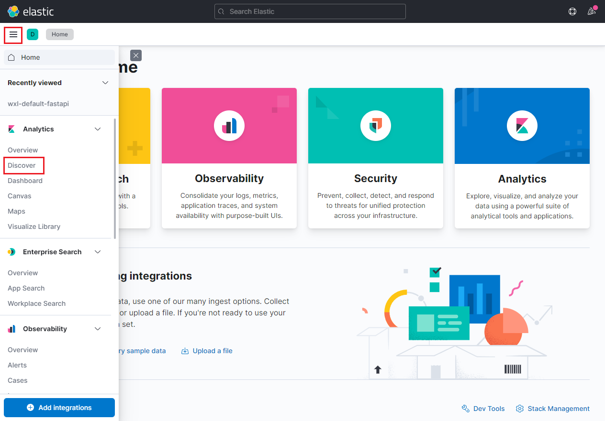

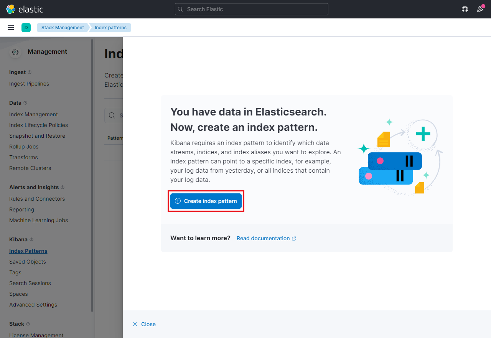

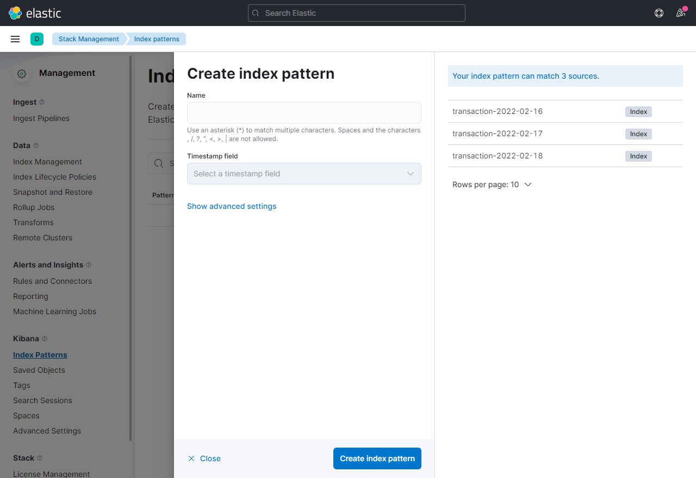

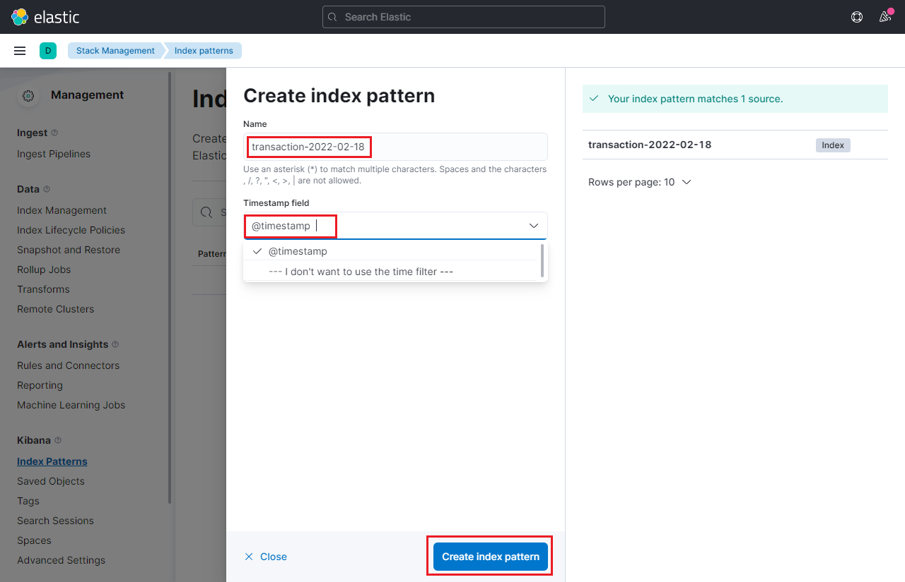

#### 探索日志


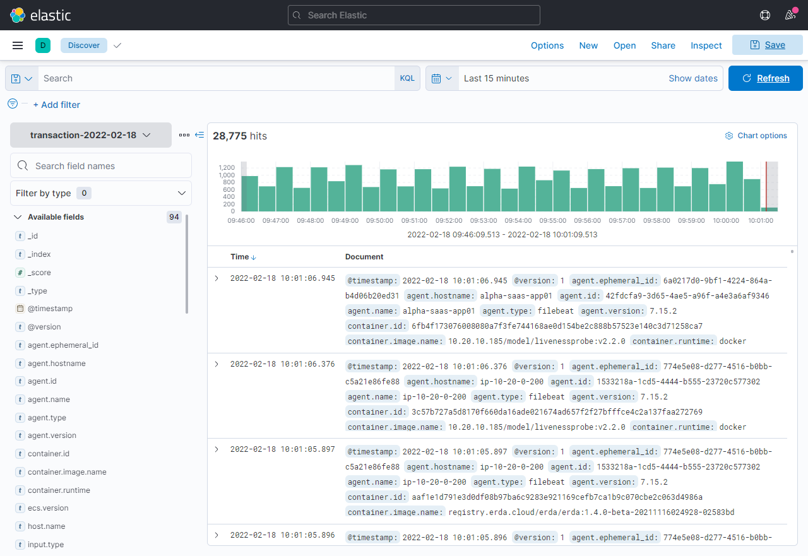

#### 删选日志

Kubernetes 服务建议删选标签顺序:

1. 指定 namespace
2. 根据 pod 控制器名称进行筛选
3. pod 有多个 container 的情况下，需要根据 kubernetes.container.name 再次做删选

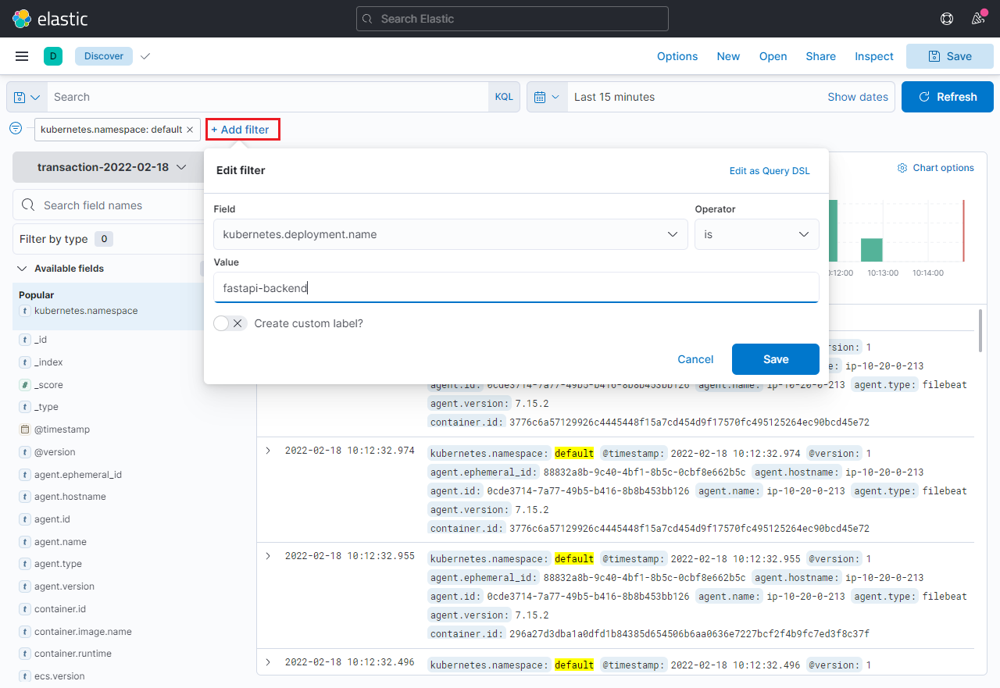

#### 自动刷新

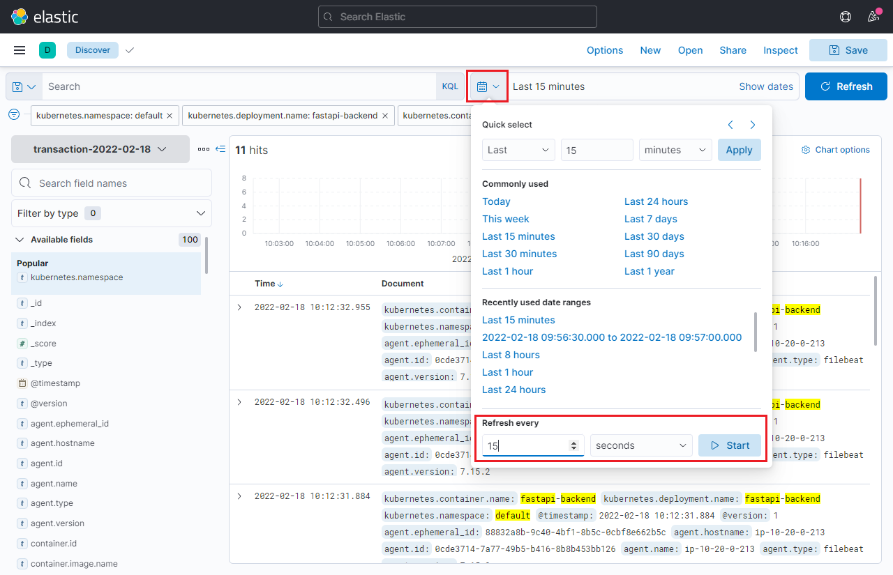

#### 查看日志

点击一条日志详情，找到 message 字段，切换到显示列表，让页面显示输出日志。

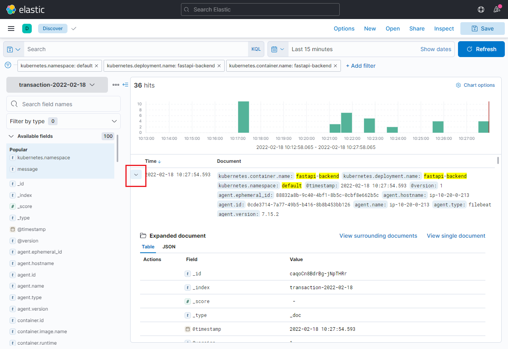

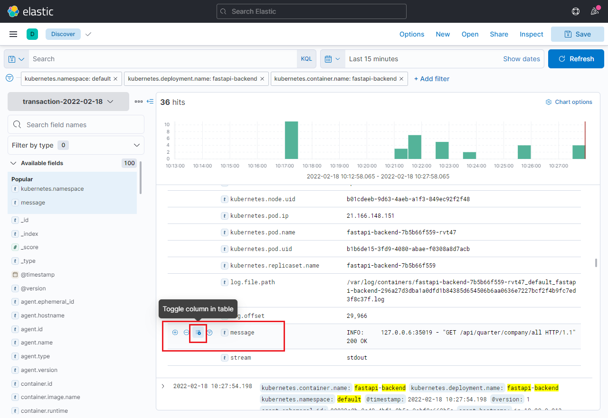

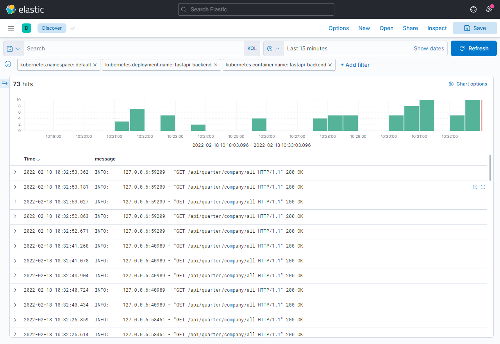

**注**：Kibana 文档地址 [Kibana 7.16](https://www.elastic.co/guide/en/kibana/7.16/index.html) 
