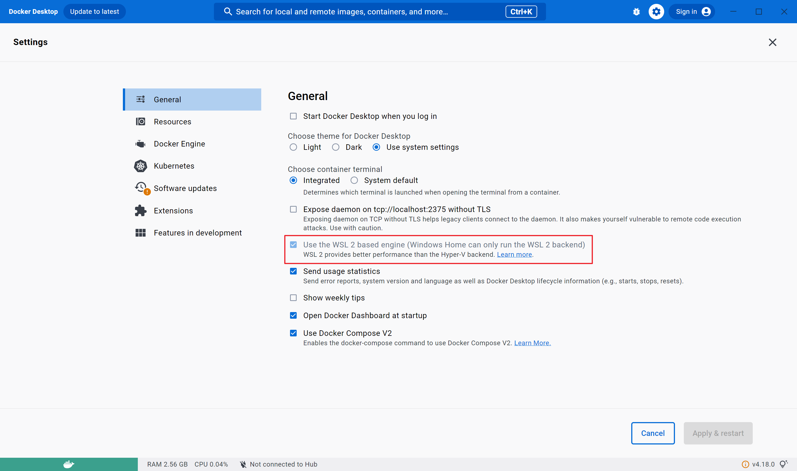
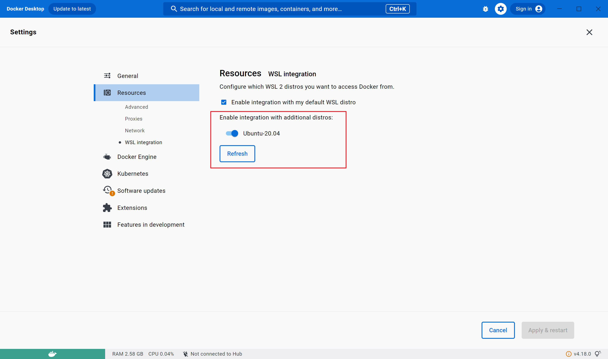

### Go 开发环境搭建

安装 docker-desktop，https://www.docker.com/products/docker-desktop/

有两点需要注意：

1. 使用 WSL 2 engine

   

2. WSL Ubuntu 可以连接

   

为接下来的安装设置代理

```shell
hostip=172.20.80.1
port=1080
export http_proxy="http://${hostip}:${port}"
export https_proxy="http://${hostip}:${port}"
```

安装 docker client，连接 windoos docker

```bash
sudo apt-get install docker.io
```

安装gvm ，地址：`https://github.com/moovweb/gvm`

```bash
bash < <(curl -s -S -L https://raw.githubusercontent.com/moovweb/gvm/master/binscripts/gvm-installer)
```

安装 golang

```bash
#安装依赖
sudo apt-get install -y binutils bison gcc make

# golang从1.5开始就是自己编译自己，所以需要第一个二进制版本的golang
gvm install go1.4 -B

# 设置使用这个版本
gvm use go1.4

# 设置环境变量，这个变量会在编译后续版本的时候使用
export GOROOT_BOOTSTRAP=$GOROOT

# 安装我们想要的go版本
gvm install go1.19

# 设置新版本为默认版本
gvm use go1.19 --default
```

设置 go 环境变量

```
go env -w GO111MODULE=on
go env -w GOPROXY=https://goproxy.cn,direct
```

安装 kubectl
官方文档 `https://kubernetes.io/docs/tasks/tools/install-kubectl-linux/`

```bash
curl -LO "https://dl.k8s.io/release/$(curl -L -s https://dl.k8s.io/release/stable.txt)/bin/linux/amd64/kubectl"
sudo mv kubectl /usr/local/bin/
```

指定版本安装

```bash
curl -LO "https://dl.k8s.io/release/v1.24.3/bin/linux/amd64/kubectl"
chmod +x kubectl
sudo mv kubectl /usr/local/bin/
```

安装kind

```bash
go install sigs.k8s.io/kind@v0.14.0
```

安装k8s

```bash
kind create cluster --name=1.24.3 --image kindest/node:v1.24.3
```

