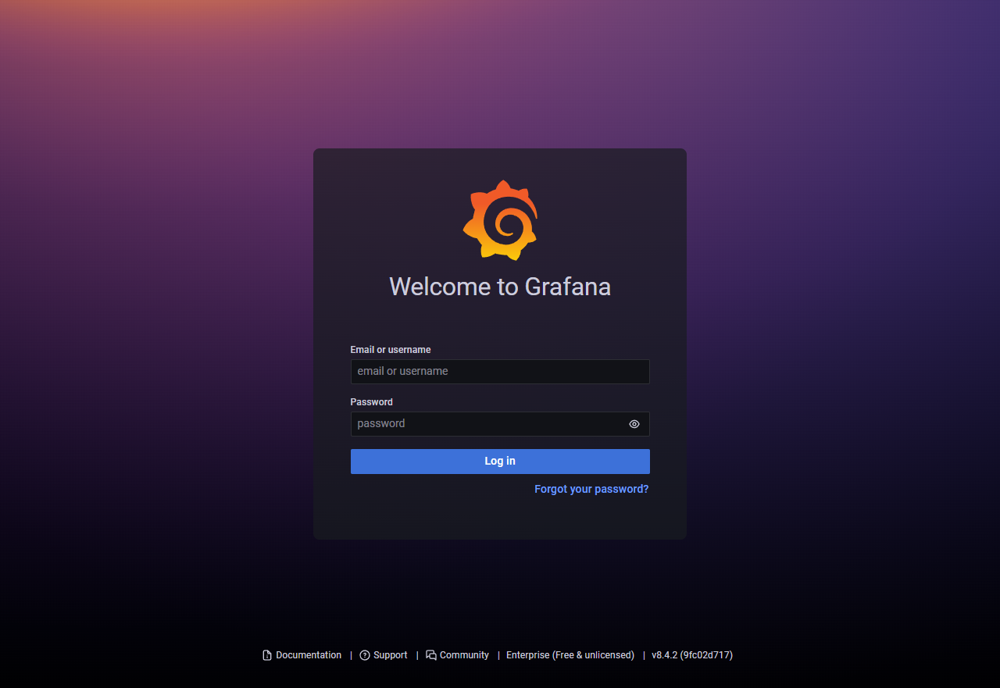

### 前言

本来准备将 Grafana 放到 Prometheus 文中介绍的，但是在查资料时发现它并不仅仅只是数据可视化软件而已。不仅支持多种数据源，还有了自己的指标收集器。更是在 2019、2020、2021 年完成 A、B、C 轮融资各 2400万、5000万和 2.2 亿美元融资，于是便独立出来学习。

### 概述

Grafana 是一个开源的、多平台的、可以对数据进行分析且实现交互式可视化的 Web 应用程序。接下来通过 Grafana 的起源、架构、部署和使用来对其进行学习和理解。

### 起源

Grafana 的创建者是 Torkel Ödegaard，刚开始他使用 Graphite，发现基本没有用户界面，然后他发现了 Kibana，当他考虑将 Kibana 作为以时间序列和图表为中心的可视化工具时，觉得 Kibana 界面的影响因素太多了，例如每个页面都有许多功能按键。所以他希望有一个更简单、更干净、优美且有更少分散注意力的界面，这也成为 Grafana 早期的设计原则和理念，公司早期的海报也强调了这一点，内容为：Don’t get in the way of the data。于是 Torkel  fork 了 Kibana，以此作为参考，花了三个月左右完成了 Grafana。并与 2014 年 1 月 20 日发布了第一个开源版本 Grafana v1.0.0 。


**注**：参考链接 [history-of-grafana](https://grafana.com/blog/2019/09/03/the-mostly-complete-history-of-grafana-ux/) 、 [grafana-creator](https://flagsmith.com/podcast/torkel-odegaard-grafana-creator-project-lead/) 、 [grafana-labs](https://grafana.com/blog/2019/10/04/grafana-labs-at-5-how-we-got-here-and-where-were-going/) 和 [wikipedia Grafana](https://en.wikipedia.org/wiki/Grafana) 

### 架构

Grafana 架构是使用非常广泛的 BS 架构，Grafana 真正重要的不是架构，而是 UI 的使用。

### 部署

#### 单机部署

从 https://grafana.com/grafana/download 下载 Grafana 安装包，这里选择二进制安装。

```bash
$ wget https://dl.grafana.com/enterprise/release/grafana-enterprise-8.4.2.linux-amd64.tar.gz
$ tar -zxvf grafana-enterprise-8.4.2.linux-amd64.tar.gz
$ cd grafana-8.4.2/
$ ./bin/grafana-server web
```

#### 重新安装

二进制文件想要重新安装的话只需将目录下的 data 文件删除掉重新启动即可。

```bash
$ rm -rf data
$ ./bin/grafana-server web
```

**注**：参考链接 [grafana installation](https://grafana.com/docs/grafana/latest/installation/debian/) 和 [grafana quick start](https://www.cnblogs.com/chanshuyi/p/02_grafana_quick_start.html) 

### 使用

#### 登录

访问 http://localhost:3000/ 或者外部访问 http://hostip:3000/ ，进入登录界面：



