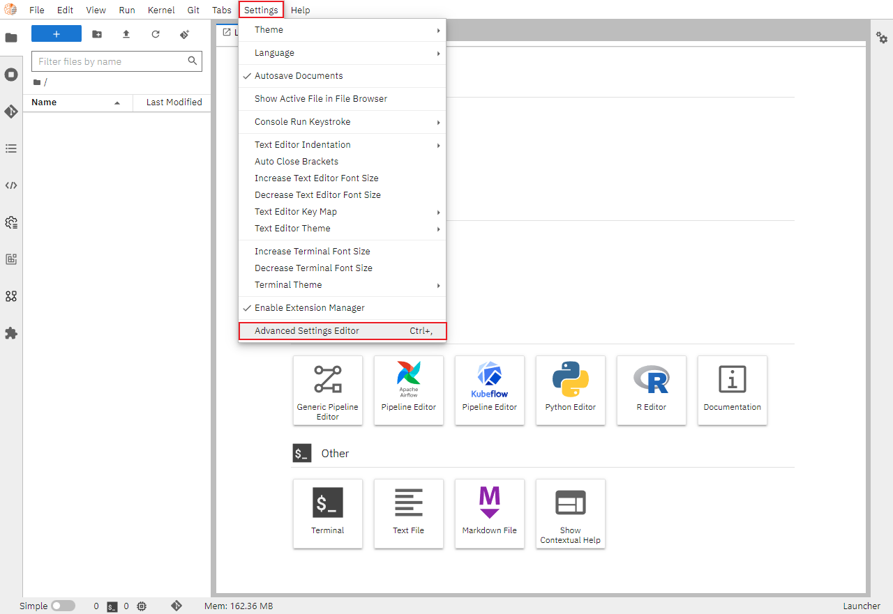
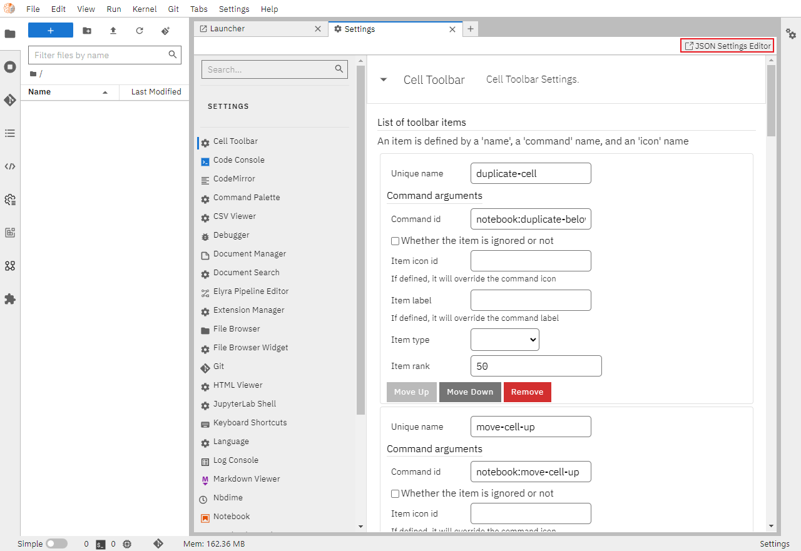
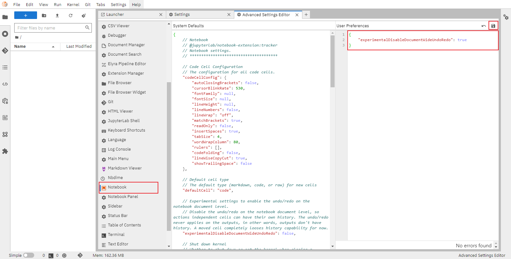

### Jupyter 撤消选定单元格中内容

进入 Jupyter 界面，点击 Settings 下的 Advanced Settings Editor 进入设置界面。



选择 JSON Settings Editor 进入设置界面。



选择 Notebook 写入如下内容，完成后点击保存。刷新页面后配置生效。

```json
{
    "experimentalDisableDocumentWideUndoRedo": true
}
```



