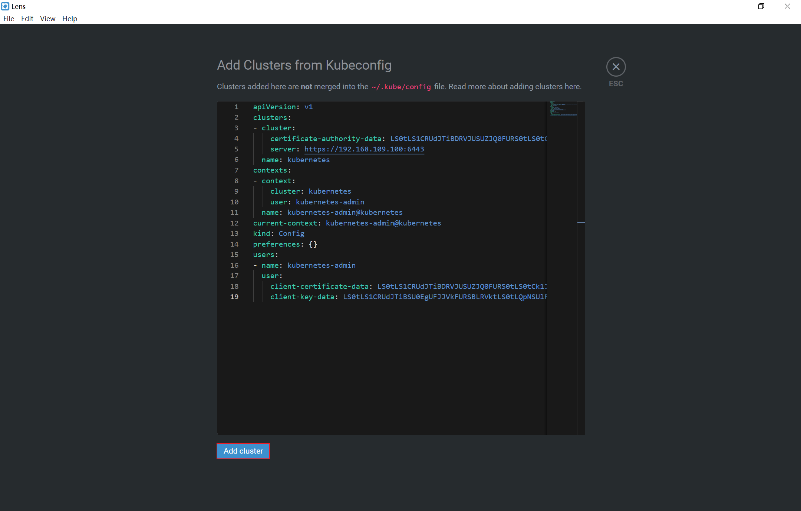
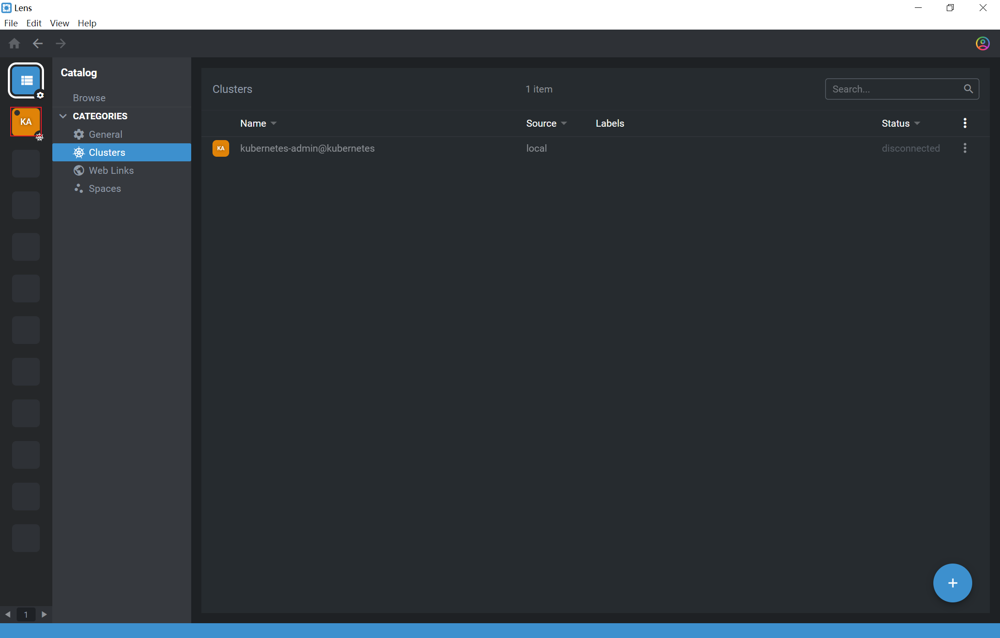

### Lens 使用文档

#### 添加集群

获取 k8s 集群配置文件

打开 Lens

选择添加集群

粘贴 k8s 配置文件内容，点击 `Add cluster` 

点击 `Catalog` ，选择  `Clusters` 

选择刚刚添加的集群，固定标签到左侧菜单栏

点击左侧图标，链接集群

选择 `Workloads` 下的 `Overview` 查看已有资源

#### 查看日志、进入 Pod

选择 `Pods` ，选中需要查看日志的 pod，选择查看日志，有两种方式。进入 `pod` 与之类似，选择 `Shell` 即可 

