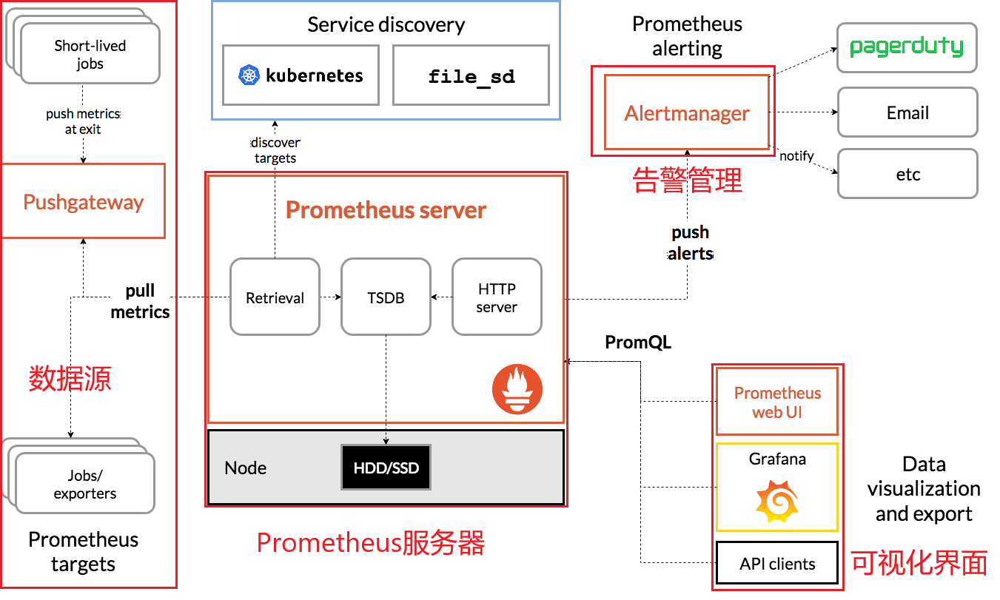
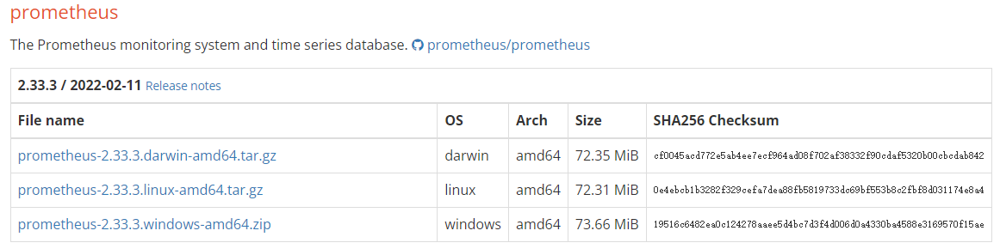
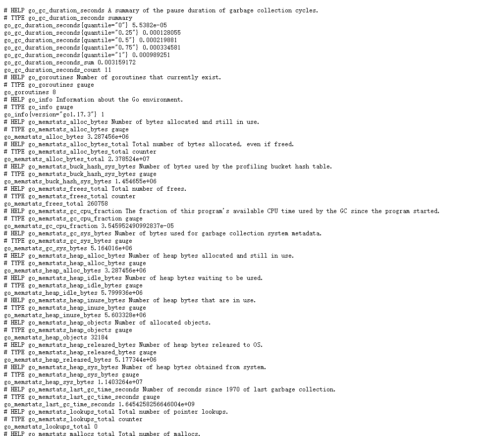
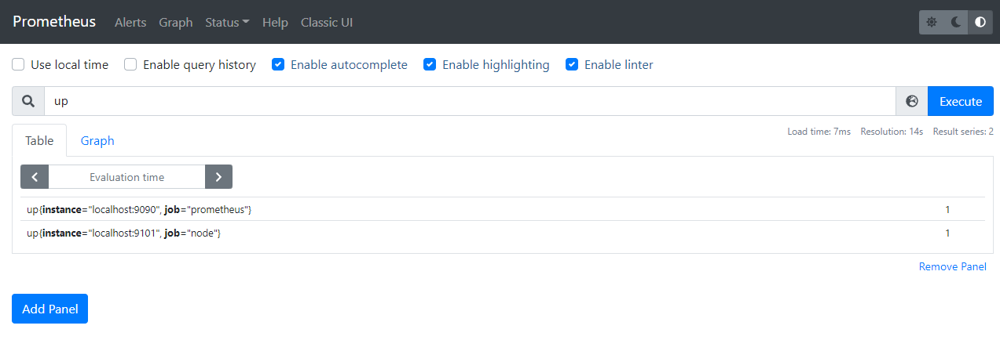
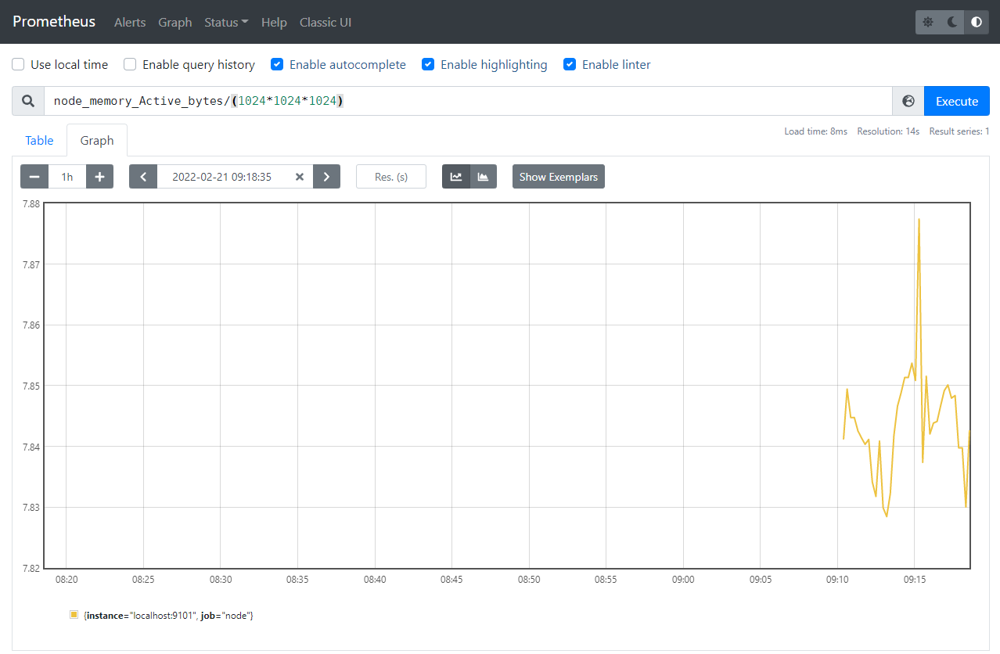
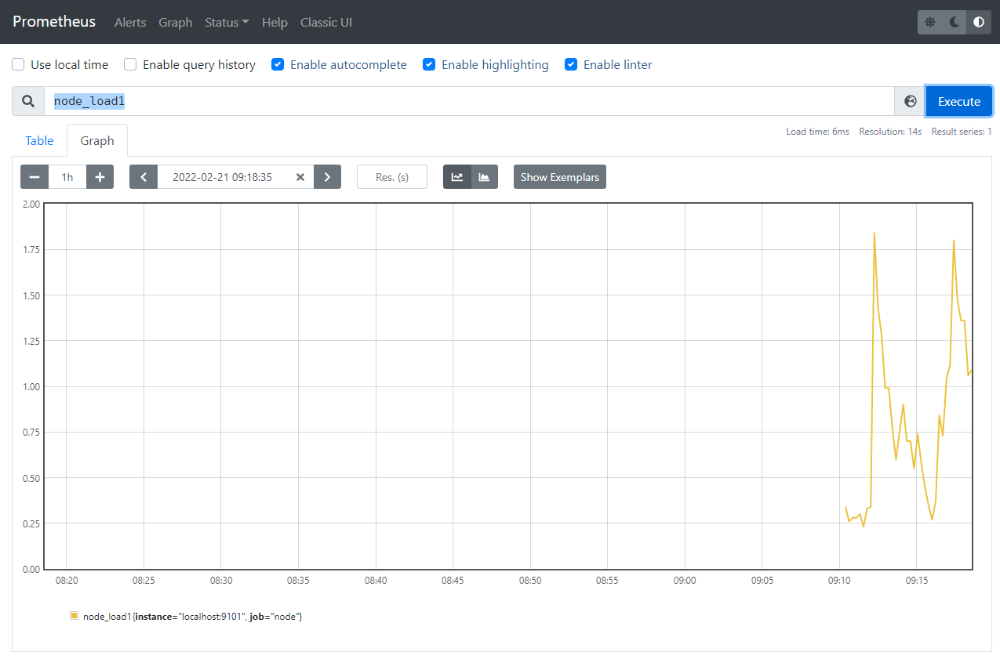

### 概述

Prometheus 是一个开源软件，其作用是对系统进行监控和告警。Prometheus 在 2016 年加入CNCF 社区，成为继 Kubernetes 之后的第二个托管项目。接下来将通过对 Prometheus 的起源、架构、部署和使用来对其进行学习和理解。

### 起源

公司层面，SoundCloud 公司在转向微服务架构后，原有的监控系统不足以满足需求。个人层面，Julius Volz 在 2012 年从 Google 加入 SoundCloud 后，发现 SoundCloud 并没有微服务架构的动态环境监控工具。在此前提下，以 Google 内部对其集群进行监控的方式为启发，由 Julius Volz 主导，启动了一个监控项目。最终，这个项目发展为 SoundCloud 公司的监控系统： Prometheus。

**注**：参考链接 [Prometheus_(software)](https://en.wikipedia.org/wiki/Prometheus_(software)) 及其扩展

### 架构

Prometheus 的基本架构如下：



Prometheus 分为四部分：

- **Prometheus 服务器**

  Prometheus Server 是 Prometheus 组件中的核心部分，负责对监控数据的获取，存储以及查询

- **NodeExporter 业务数据源**

  业务数据源通过 Pull/Push 两种方式推送数据到 Prometheus Server

- **AlertManager 告警管理器**

  Prometheus 可以配置告警规则，如果符合规则，就将告警推送到 AlertManager，由其进行统一处理

- **可视化监控界面**

  Prometheus 收集到数据后，由 WebUI 可视化展示，也可通过 API 进行调用展示。目前常用 Grafana 对接 API 进行可视化

Prometheus 架构宏观上看并不复杂，其实整个过程就是：数据收集 > 数据处理 > 数据展示。

**注**：参考链接 [prometheus](https://www.cnblogs.com/chanshuyi/p/01_head_first_of_prometheus.html) 和 [prometheus overview](https://prometheus.io/docs/introduction/overview/) 

### 部署

#### 单机部署

Prometheus 单机部署实现对服务器 CPU、内存和硬件信息监控。

#####  部署 Prometheus Server

 从 https://prometheus.io/download/ 下载 Prometheus Sevrer软件包：



linux 系统：

```bash
$ wget https://github.com/prometheus/prometheus/releases/download/v2.33.3/prometheus-2.33.3.linux-amd64.tar.gz
$ tar xvfz prometheus-2.33.3.linux-amd64.tar.gz
$ cd prometheus-2.33.3.linux-amd64
```

使用 `--help` 查看选项，特别注意两个参数 `--config.file` 和 `--web.listen-address`：

```bash
$ ./prometheus --help
usage: prometheus [<flags>]

The Prometheus monitoring server

Flags:
  -h, --help                     Show context-sensitive help (also try --help-long and --help-man).
      --version                  Show application version.
      --config.file="prometheus.yml"  
                                 Prometheus configuration file path.
      --web.listen-address="0.0.0.0:9090"  
                                 Address to listen on for UI, API, and telemetry.
```

配置文件 prometheus.yml 默认如下，具体含义查看链接 [first_steps](https://prometheus.io/docs/introduction/first_steps/) ：

```yaml
# my global config
global:
  scrape_interval: 15s # Set the scrape interval to every 15 seconds. Default is every 1 minute.
  evaluation_interval: 15s # Evaluate rules every 15 seconds. The default is every 1 minute.
  # scrape_timeout is set to the global default (10s).

# Alertmanager configuration
alerting:
  alertmanagers:
    - static_configs:
        - targets:
          # - alertmanager:9093

# Load rules once and periodically evaluate them according to the global 'evaluation_interval'.
rule_files:
  # - "first_rules.yml"
  # - "second_rules.yml"

# A scrape configuration containing exactly one endpoint to scrape:
# Here it's Prometheus itself.
scrape_configs:
  # The job name is added as a label `job=<job_name>` to any timeseries scraped from this config.
  - job_name: "prometheus"

    # metrics_path defaults to '/metrics'
    # scheme defaults to 'http'.

    static_configs:
      - targets: ["localhost:9090"]
```

启动 Prometheus

默认配置文件启动 Prometheus，默认参数 `--web.listen-address="0.0.0.0:9090"` ，故外部也可访问。

```bash
$ ./prometheus --config.file=prometheus.yml
```

此时 http://localhost:9090/ 可以浏览到自身状态，http://localhost:9090/metrics 可以看到有关自身的指标。外部访问将 localhost 换为服务器ip即可访问。

##### 部署 Node Exporter

Node Exporter 是 Prometheus 提供的一个可以采集到 Linux 主机信息程序，可采集机器的 CPU、内存、磁盘等指标信息。部署如下：

```bash
$ wget ttps://github.com/prometheus/node_exporter/releases/download/v1.3.1/node_exporter-1.3.1.linux-amd64.tar.gz
$ tar xvfz node_exporter-1.3.1.linux-amd64.tar.gz
$ cd node_exporter-1.3.1.linux-amd64
```

启动 Node Exporter，使用9101端口：

```bash
$ ./node_exporter --web.listen-address="0.0.0.0:9101"
```

访问 http://host-ip:9101/ 可以看到以下页面：


访问 http://host-ip:9101/metrics 可以看到以下输出：



每一项指标监控形式如下，其中 HELP 用于解释当前指标的含义，TYPE 则说明当前指标的数据类型。

```bash
# HELP node_load1 1m load average.
# TYPE node_load1 gauge
node_load1 1.15
# HELP node_load15 15m load average.
# TYPE node_load15 gauge
node_load15 3.89
# HELP node_load5 5m load average.
# TYPE node_load5 gauge
node_load5 1.97
```

##### 查看指标

修改 Prometheus 配置文件，添加监控数据源，从 Node Exporter 中获取指标。编辑 prometheus.yml 在 scrape_configs 下添加 node exporte 内容:

```yaml
scrape_configs:
  # The job name is added as a label `job=<job_name>` to any timeseries scraped from this config.
  - job_name: "prometheus"
    # metrics_path defaults to '/metrics'
    # scheme defaults to 'http'.
    static_configs:
      - targets: ["localhost:9090"]

  # 采集node exporter监控数据
  - job_name: 'node'
    static_configs:
      - targets: ['localhost:9101']
```

访问  http://host-ip:9090/ ，输入 up 执行，结果如下，value 为 1 表示激活状态，添加成功。



输入 `node_memory_Active_bytes/(1024*1024*1024)` 和 `node_load1` 查看机器的内存使用情况和CPU 1 分钟的负载情况。





**注**：参考链接 [prometheus](https://www.cnblogs.com/chanshuyi/p/01_head_first_of_prometheus.html) 和 [first_steps](https://prometheus.io/docs/introduction/first_steps/) 

##### 部署 Grafana

Prometheus UI 提供了快速验证 PromQL 以及临时可视化能力，但其可视化能力较弱。更多场景下，Prometheus 可视化使用另一个开源软件 Grafana 完成。

