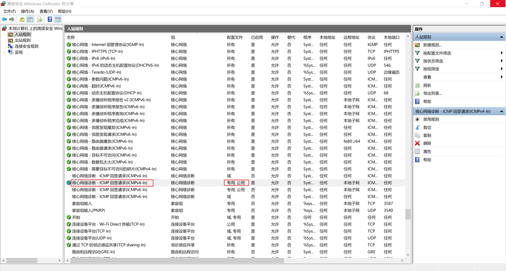

### WSL 卸载

```bash
wsl --unregister Ubuntu-20.04
```

### 查看可安装的 Linux 的 Windows 子系统

```bash
wsl --list --online
```

### WSL 安装

```bash
wsl --install -d Ubuntu-20.04
```

WSL 设置默认子系统

```bash
wslconfig /setdefault Ubuntu-20.04
```

### 换华为源

```bash
sudo cp /etc/apt/sources.list /etc/apt/sources.list.back
sudo sed -i "s@http://.*archive.ubuntu.com@http://repo.huaweicloud.com@g" /etc/apt/sources.list
sudo sed -i "s@http://.*security.ubuntu.com@http://repo.huaweicloud.com@g" /etc/apt/sources.list
```

```bash
sudo apt install net-tools
```

### SSH 登录

```bash
(port 22): Connection failed.
```

```bash
# 取消注释
Port 22
```

重启 SSH 报错

```bash
 * Starting OpenBSD Secure Shell server sshd                                                                            sshd: no hostkeys available -- exiting.
```

执行以下命令，然后重启

```bash
~# ssh-keygen -A
ssh-keygen: generating new host keys: RSA DSA ECDSA ED25519
```

```bash
/etc/init.d/ssh restart
```

登录报错

```
Warning: Permanently added '172.18.36.167' (ECDSA) to the list of known hosts.
root@172.18.36.167: Permission denied (publickey).
```

修改以下值 `vim /etc/ssh/sshd_config` ，重启 SSH

```
PasswordAuthentication yes
```

root 登录报错

```
root@172.18.36.167's password:
Permission denied, please try again.
```

修改以下值 `vim /etc/ssh/sshd_config` ，重启 SSH

```
#PermitRootLogin prohibit-password
PermitRootLogin yes
```

重置 root 密码，登陆成功

```
passwd root
```

### wsl2 ping不通 windows 主机

首先尝试 ping 网关，获取网关地址 ping

```bash
ip=$(cat /etc/resolv.conf |grep -oP '(?<=nameserver\ ).*')
ping $ip
```

如果 ping 不通，以管理员权限运行 powershell，输入以下命令

```bash
New-NetFirewallRule -DisplayName "WSL" -Direction Inbound  -InterfaceAlias "vEthernet (WSL)"  -Action Allow
```

这个时候可以可以 ping 网关，但是还是 ping 不通 windows ip，在防火墙中启用这一条规则，完成。



**参考：** https://blog.csdn.net/Cypher_X/article/details/123011200

### 使用代理

```bash
#第一条没用
#export all_proxy="socks5://${hostip}:${port}"
#下面代理成功
hostip=192.168.1.109
port=1080
export http_proxy="http://${hostip}:${port}"
export https_proxy="http://${hostip}:${port}"
```

### 添加使用 docker 权限

```bash
sudo chmod a+rw /var/run/docker.sock
```

