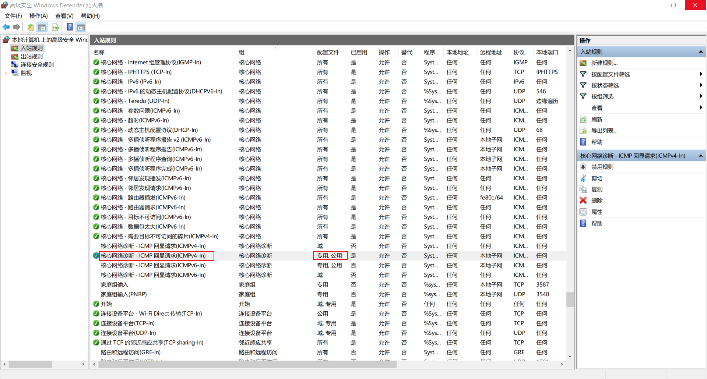

### WSL 卸载

```bash
wsl --unregister Ubuntu-20.04
```

### 查看可安装的 Linux 的 Windows 子系统

```bash
wsl --list --online
```

### WSL 安装

```bash
wsl --install -d Ubuntu-20.04
```

WSL 设置默认子系统

```bash
wslconfig /setdefault Ubuntu-20.04
```

### 换华为源

```bash
sudo cp /etc/apt/sources.list /etc/apt/sources.list.back
sudo sed -i "s@http://.*archive.ubuntu.com@http://repo.huaweicloud.com@g" /etc/apt/sources.list
sudo sed -i "s@http://.*security.ubuntu.com@http://repo.huaweicloud.com@g" /etc/apt/sources.list
```

```bash
sudo apt install net-tools
```

### SSH 登录

```bash
(port 22): Connection failed.
```

```bash
# 取消注释
Port 22
```

重启 SSH 报错

```bash
 * Starting OpenBSD Secure Shell server sshd                                                                            sshd: no hostkeys available -- exiting.
```

执行以下命令，然后重启

```bash
~# ssh-keygen -A
ssh-keygen: generating new host keys: RSA DSA ECDSA ED25519
```

```bash
/etc/init.d/ssh restart
```

登录报错

```
Warning: Permanently added '172.18.36.167' (ECDSA) to the list of known hosts.
root@172.18.36.167: Permission denied (publickey).
```

修改以下值 `vim /etc/ssh/sshd_config` ，重启 SSH

```
PasswordAuthentication yes
```

root 登录报错

```
root@172.18.36.167's password:
Permission denied, please try again.
```

修改以下值 `vim /etc/ssh/sshd_config` ，重启 SSH

```
#PermitRootLogin prohibit-password
PermitRootLogin yes
```

重置 root 密码，登陆成功

```
passwd root
```

### wsl2 ping不通 windows 主机

首先尝试 ping 网关，获取网关地址 ping

```bash
ip=$(cat /etc/resolv.conf |grep -oP '(?<=nameserver\ ).*')
ping $ip
```

如果 ping 不通，以管理员权限运行 powershell，输入以下命令

```bash
New-NetFirewallRule -DisplayName "WSL" -Direction Inbound  -InterfaceAlias "vEthernet (WSL)"  -Action Allow
```

这个时候可以可以 ping 网关，但是还是 ping 不通 windows ip，在防火墙中启用这一条规则，完成。



**参考：** https://blog.csdn.net/Cypher_X/article/details/123011200

### 使用代理

```bash
#第一条没用
#export all_proxy="socks5://${hostip}:${port}"
#下面代理成功
hostip=192.168.1.109
port=1080
export http_proxy="http://${hostip}:${port}"
export https_proxy="http://${hostip}:${port}"
```

### 添加使用 docker 权限

```bash
sudo chmod a+rw /var/run/docker.sock
```

### 最新更新202606

查看虚拟机

```sh
wsl -l -v
  NAME            STATE           VERSION
* Ubuntu-24.04    Stopped         2
```

删除清理

```bash
PS C:\Windows\System32> wsl --unregister Ubuntu-24.04
正在注销。
操作成功完成。

PS C:\Windows\System32> wsl -l -v
适用于 Linux 的 Windows 子系统没有已安装的分发。
可通过安装包含以下说明的分发来解决此问题：

使用“wsl.exe --list --online' ”列出可用的分发
和 “wsl.exe --install <Distro>” 进行安装。
```

查看可安装列表

```bash
PS C:\Windows\System32> wsl --list --online
以下是可安装的有效分发的列表。
使用“wsl.exe --install <Distro>”安装。

NAME                            FRIENDLY NAME
Ubuntu                          Ubuntu
Ubuntu-26.04                    Ubuntu 26.04 LTS
Ubuntu-24.04                    Ubuntu 24.04 LTS
Ubuntu-22.04                    Ubuntu 22.04 LTS
openSUSE-Tumbleweed             openSUSE Tumbleweed
openSUSE-Leap-16.0              openSUSE Leap 16.0
SUSE-Linux-Enterprise-15-SP7    SUSE Linux Enterprise 15 SP7
SUSE-Linux-Enterprise-16.0      SUSE Linux Enterprise 16.0
kali-linux                      Kali Linux Rolling
Debian                          Debian GNU/Linux
AlmaLinux-8                     AlmaLinux OS 8
AlmaLinux-9                     AlmaLinux OS 9
AlmaLinux-Kitten-10             AlmaLinux OS Kitten 10
AlmaLinux-10                    AlmaLinux OS 10
archlinux                       Arch Linux
FedoraLinux-44                  Fedora Linux 44
FedoraLinux-43                  Fedora Linux 43
eLxr                            eLxr 12.12.0.0 GNU/Linux
OracleLinux_7_9                 Oracle Linux 7.9
OracleLinux_8_10                Oracle Linux 8.10
OracleLinux_9_5                 Oracle Linux 9.5
SUSE-Linux-Enterprise-15-SP6    SUSE Linux Enterprise 15 SP6
```

安装Ubuntu-24.04

第一次必须先完成初始化创建普通用户，之后才能正常用 root

设置完成后使用root用户登录，并且设置默认用户为root，避免后续开发权限问题

```sh
wsl --install -d Ubuntu-24.04

正在下载: Ubuntu 24.04 LTS
正在安装: Ubuntu 24.04 LTS
已成功安装分发。可以通过 “wsl.exe -d Ubuntu-24.04” 启动它
正在启动 Ubuntu-24.04...
Provisioning the new WSL instance Ubuntu-24.04
This might take a while...
```

```sh
wsl -d Ubuntu-24.04 -u root

root@H:/mnt/c/Windows/System32# cat > /etc/wsl.conf <<'EOF'
[user]
default=root
EOF

root@H:/mnt/c/Windows/System32# reboot

wsl -d Ubuntu-24.04
```

使用本机代理

```powershell
notepad $env:USERPROFILE\.wslconfig
```

写入

```
[wsl2]
networkingMode=mirrored
autoProxy=false
dnsTunneling=true
```

查看ubuntu版本，换源

```sh
lsb_release -a
No LSB modules are available.
Distributor ID: Ubuntu
Description:    Ubuntu 24.04.4 LTS
Release:        24.04
Codename:       noble
```

中科大换源

```bash
sudo cp /etc/apt/sources.list.d/ubuntu.sources /etc/apt/sources.list.d/ubuntu.sources.bak

sudo sed -i 's@//.*archive.ubuntu.com@//mirrors.ustc.edu.cn@g' /etc/apt/sources.list.d/ubuntu.sources
sudo sed -i 's@//.*security.ubuntu.com@//mirrors.ustc.edu.cn@g' /etc/apt/sources.list.d/ubuntu.sources
sudo sed -i 's@http:@https:@g' /etc/apt/sources.list.d/ubuntu.sources

sudo apt update
```

还原

```bash
sudo cp /etc/apt/sources.list.d/ubuntu.sources.bak /etc/apt/sources.list.d/ubuntu.sources
sudo apt update
```

### 安装gvm

### 1. 安装依赖

```bash
sudo apt update
sudo apt install -y curl git mercurial make binutils bison gcc build-essential
```

这些是 gvm 在 Debian/Ubuntu 上官方列出的依赖。

### 2. 安装 gvm

```bash
bash < <(curl -s -S -L https://raw.githubusercontent.com/moovweb/gvm/master/binscripts/gvm-installer)
```

使用代理安装

```bash
bash < <(curl -x "http://127.0.0.1:7890" -s -S -L https://raw.githubusercontent.com/moovweb/gvm/master/binscripts/gvm-installer)
```

官方安装方式就是运行这个 installer；如果你用 zsh，把前面的 `bash` 换成 `zsh`。

安装完重新加载 shell：

```
source ~/.gvm/scripts/gvm
```

或者直接关掉 WSL 终端重新打开。

### 3. 验证

```
gvm version
gvm listall
```

`gvm listall` 用来查看可安装的 Go 版本。

## 4. 安装 Go

推荐先用二进制安装，避免源码编译和 bootstrap 问题：

```
gvm install go1.22.0 -B
gvm use go1.22.0 --default
go version
```

`-B` 表示只安装二进制包；gvm 官方也说明 `gvm install` 支持 `-B, --binary` 选项。

也可以先看可用版本：

```
gvm listall | tail -30
```

然后换成你想要的版本，例如：

```
gvm install go1.21.13 -B
gvm use go1.21.13 --default
```

#### 配置git代理

```
git config --global http.https://github.com.proxy "http://$hostip:7890"
```

#### 拉 `kubernetes` 源码，切换到 `release-1.35`分支

```bash
git clone https://github.com/kubernetes/kubernetes.git
cd kubernetes
```

```
git switch -c release-1.35 origin/release-1.35
```

#### 安装go 对应版本

```sh
cat .go-version
1.25.11
```

```sh
# 1) 确认 gvm 已加载
source ~/.gvm/scripts/gvm

# 2) 查看 gvm 是否能看到这个版本
gvm listall | grep go1.25.11

# 3) 推荐：用官方二进制安装，避免本地源码编译/bootstrap 问题
gvm install go1.25.11 -B

# 4) 切换并设为默认
gvm use go1.25.11 --default

# 5) 验证
go version
```

设置环境变量

```sh
go env -w GO111MODULE=on
go env -w GOPROXY=https://goproxy.cn,direct
```

